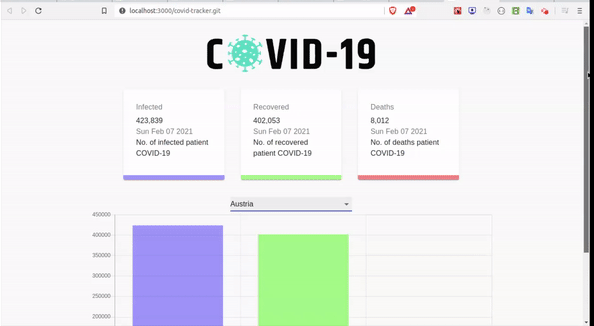

# COVID-19 Tracker

 The application tracks the no of <strong>Infected</strong> , <strong>Recovered</strong> and <strong>Death</strong>
    cases of the Covid-19 patients and visualize it in the form of charts and bar graph using library called
    <strong>Chart.js</strong>

## Tech Stack Used

<ul>
    <li>ReactJs</li>
    <li>ChartJS</li>
    <li>HTML</li>
    <li>CSS</li>
    <li>Material UI (for Styling)</li>
    
</ul>
 

